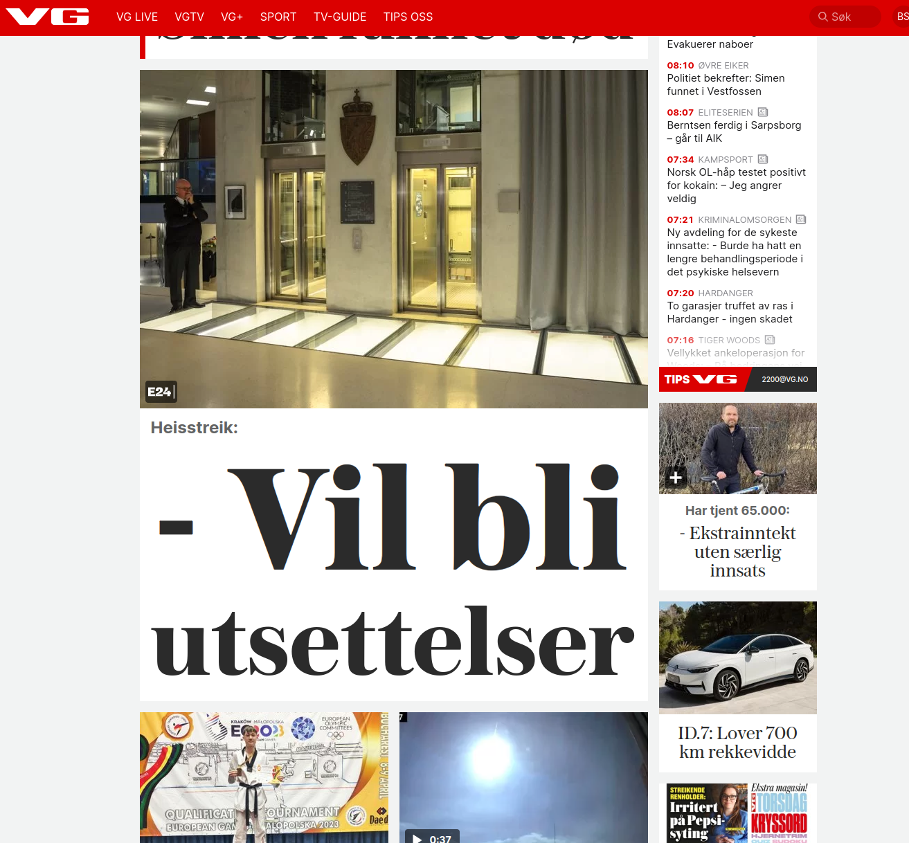
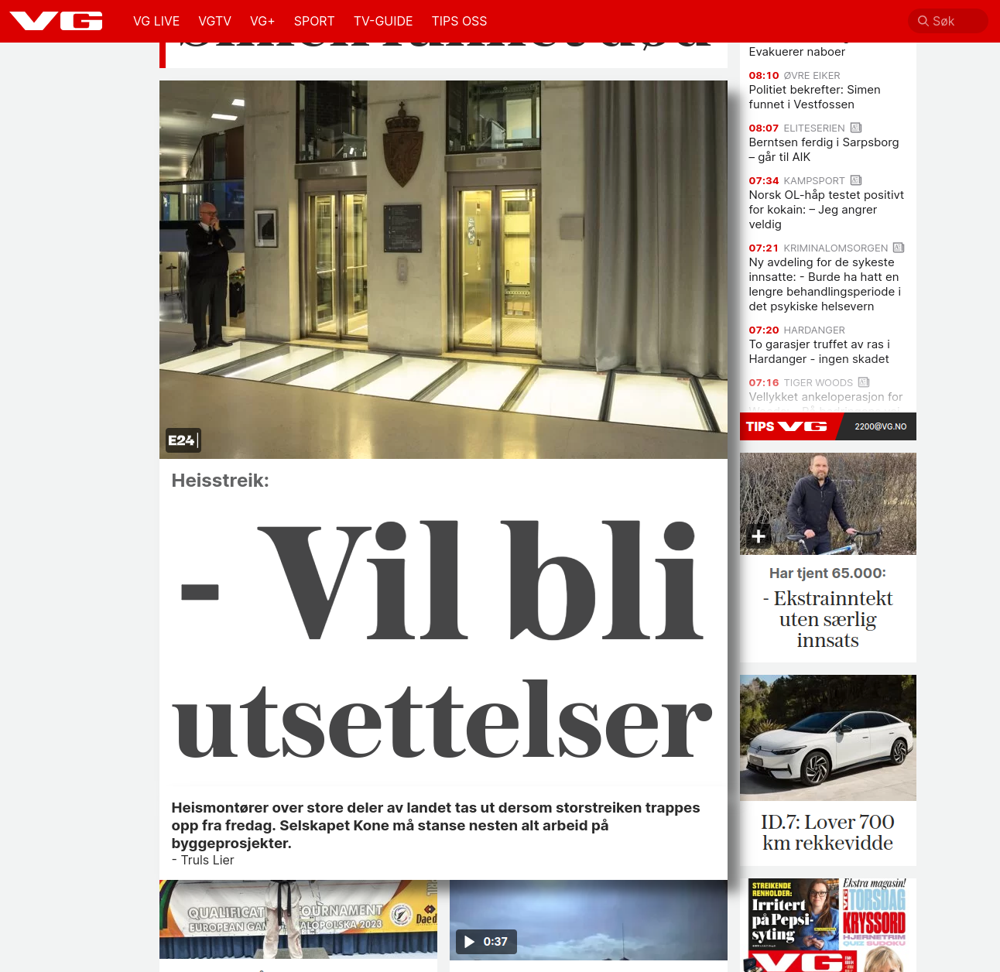

# anticlickbait

## Read the news without having to click on clickbait
This extension works on the norwegian news outlet VG.no, and helps you avoid clicking on links to figure out
whether you want to read them or not by prefetching the article and parsing it in order to extend the rubric
with subheadline and author info when you hover over it.

It only fetches once you hover, and uses @tanstack/react-query in order to avoid over-fetching.

It tries to avoid prefetching ads but VG is trying very hard to make ads look like real articles,
down to the embedded microdata.

It also has basic support for VGs partner outlets like e24, tek.no, etc.

> a chrome extension tool built with Vite + React, and Manifest v3

## Screenshots

*Normal view of VG.no front page*


*Same page but now hovering over one of the articles*

## Installing

1. Build the extension by running the following commands in this directory in a shell
```shell
$ pnpm install
$ pnpm build
```
2. Go to extension manager in chrome
3. Enable developer mode
4. Click "load unpacked" and select the build directory inside this directory

## Developing

run the command

```shell
$ cd anticlickbait

$ pnpm dev
```

### Chrome Extension Developer Mode

1. set your Chrome browser 'Developer mode' up
    * if you previously built and installed normally, remove the old version of the extension
2. click 'Load unpacked', and select `anticlickbait/build` folder

### Nomal FrontEnd Developer Mode

1. access `http://localhost:3000/`
2. when debugging options page, open `/options.html`
